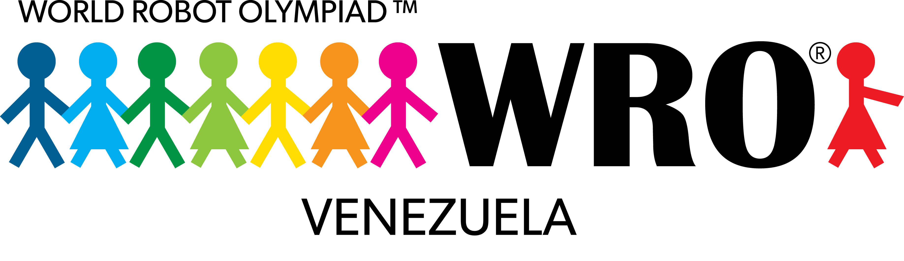

# 🤖 World Robot Olympiad Venezuela 🇻🇪

    <picture>
        
    </picture>
     
    <h2>
        ¡Bienvenidos al perfil oficial de <strong>World Robot Olympiad (WRO) Venezuela</strong> en GitHub!
    </h2>

---

La **WRO Venezuela** forma parte de uno de los eventos internacionales de robótica educativa más importantes del mundo: la **World Robot Olympiad**.

Promovemos el aprendizaje de ciencia, tecnología, ingeniería y matemáticas (STEM) a través de desafíos divertidos y creativos con robots.

---

## 🌟 ¿Qué hacemos?

- Organizamos competencias nacionales clasificatorias a la WRO Internacional.
- Fomentamos la robótica educativa en niños, niñas y jóvenes de todo el país.
- Apoyamos a educadores y mentores con recursos y herramientas tecnológicas.
- Desarrollamos software, herramientas y documentación para facilitar la participación en la WRO.

---

## 📂 Repositorios destacados

Aquí encontrarás:
<!-- - Ejemplos de código para robots LEGO® EV3, SPIKE Prime y otros kits compatibles. -->
- Guías y plantillas para entrenadores y equipos.
- Material educativo abierto y colaborativo.

---

## 🤝 Colabora con nosotros

¿Tienes ideas, sugerencias o proyectos relacionados con robótica educativa?  
¡Estamos abiertos a colaboraciones! Puedes crear un issue, abrir un pull request o simplemente unirte a la conversación.

---

## 🌐 Conéctate

- Sitio web: [https://wrovenezuela.org](https://wrovenezuela.org)
- Instagram: [@wrovenezuela](https://instagram.com/wrovenezuela)
- Telegram: [@wrovenezuela](https://t.me/wrovenezuela)

---

¡Gracias por ser parte de esta comunidad que construye el futuro con creatividad, tecnología y trabajo en equipo! 🚀
